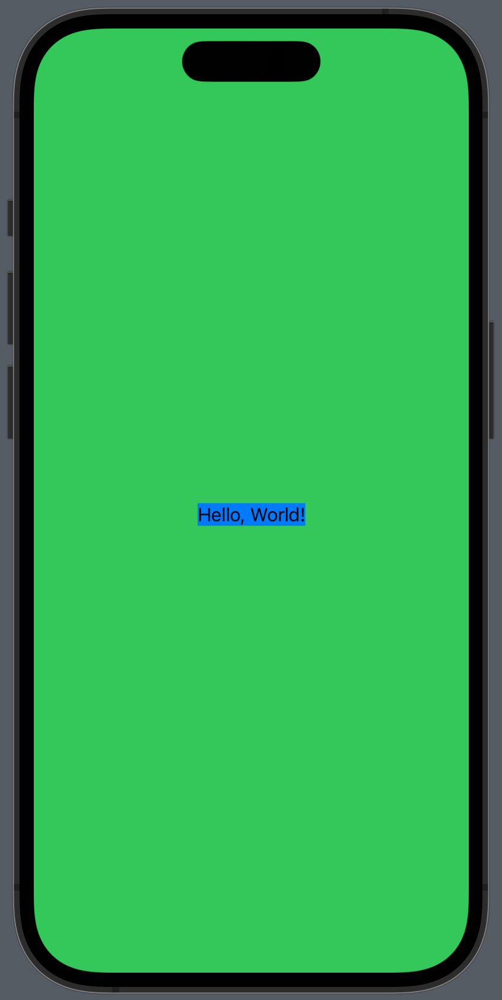
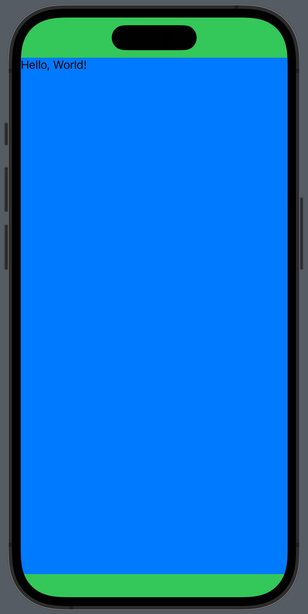

# \[SwiftUI] ScrollView의 Content Alignment 조정하기

`ScrollView`가 모든 axis로 스크롤 할 수 있을 때, 기본적으로 content가 중앙 정렬되고 content view의 크기는 content에 딱 맞게 줄어든다.

```swift
struct ScrollViewSample: View {
    var body: some View {
        ScrollView([.horizontal, .vertical]) {
            Text("Hello, World!")
                .background(.blue)
        }
        .background(.green)
    }
}
```

<figure><figcaption></figcaption></figure>

Content view의 크기를 `ScrollView` 만큼 키워서 content alignment를 조절해서 정렬 위치를 변경할 수 있다. 이 때 `ScrollView`의 크기를 구하기 위해 `GeometryReader`가 사용된다.

```swift
struct ScrollViewSample: View {
    var body: some View {
        GeometryReader { geometryProxy in
            ScrollView([.horizontal, .vertical]) {
                Text("Hello, World!")
                    .frame(
                        minWidth: geometryProxy.size.width,
                        minHeight: geometryProxy.size.height,
                        alignment: .topLeading
                    )
                    .background(.blue)
            }
        }
        .background(.green)
    }
}
```

* `ScrollView`의 content size가 늘어남에 따라 스크롤 가능하도록 만들기 위해 minWidth, minHeight 사용
* `.frame(width:height:)`을 사용하면 실제 content가 화면 영역을 벗어나더라도 content size는 화면 size로 고정되어 스크롤 할 수 없다.
* Content가 왼쪽 상단부터 시작되게 하려면 `.topLeading`으로 alignment 설정

<figure><figcaption></figcaption></figure>

## Reference


