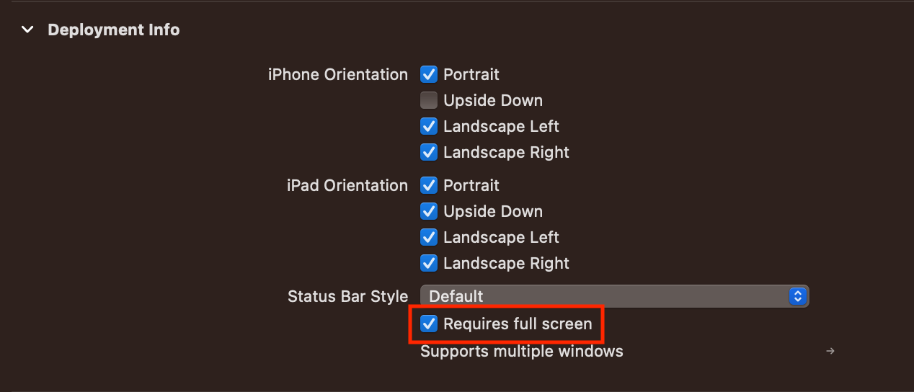
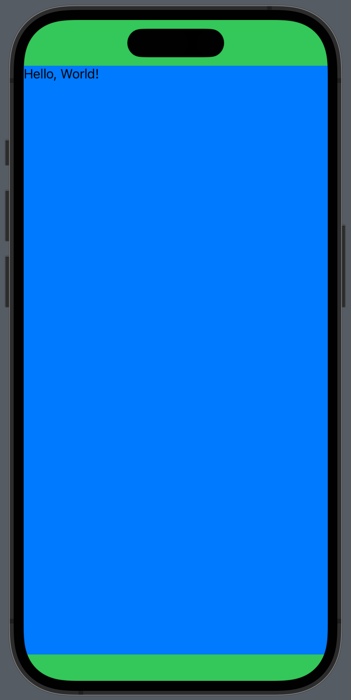

---
layout:
  title:
    visible: true
  description:
    visible: false
  tableOfContents:
    visible: true
  outline:
    visible: true
  pagination:
    visible: true
---

# Device를 강제로 회전시키는 방법

## UIDeviceOrientation 변경 (Deprecated)

```swift
let orientation = UIDeviceOrientation.landscapeLeft
UIDevice.current.setValue(orientation.rawValue, forKey: "orientation")
UIViewController.attemptRotationToDeviceOrientation()
```

1. `UIDevice`의 orientation 속성은 readonly이지만 KVC 방식으로 변경할 수 있다.
2. `UIViewController`의 class method인 [`attemptRotationToDeviceOrientation()`](https://developer.apple.com/documentation/uikit/uiviewcontroller/1621400-attemptrotationtodeviceorientati) 을 호출한다.
   * 이 method는 현재 설정된 device orientation에 맞게 window를 회전시킨다.
   * 실제로 device를 회전시킬 때에도 orientation 값이 변경되면 system이 이 method를 실행한다.

## Window Geometry 변경 (over iOS 16)

```swift
let windowScene = UIApplication.shared.connectedScenes.first as? UIWindowScene
windowScene?.requestGeometryUpdate(.iOS(interfaceOrientations: .landscapeRight))
setNeedsUpdateOfSupportedInterfaceOrientations()
```

1. `UIWindowScene`의 [`requestGeometryUpdate(_:errorHandler:)`](https://developer.apple.com/documentation/uikit/uiwindowscene/3975944-requestgeometryupdate)를 호출한다.
   * 이 method는 window scene의 geometry를 변경하도록 요청한다.
   * [`UIWindowScene.GeometryPreferences`](https://developer.apple.com/documentation/uikit/uiwindowscene/geometrypreferences)를 parameter로 전달하면서 변경할 orientation을 지정한다.
     * `UIWindowScene.GeometryPreferences.iOS` : iOS app의 window scene geometry
     * `UIWindowScene.GeometryPreferences.Mac` : macOS app의 window scene geometry
2. `UIViewController`의 [`setNeedsUpdateOfSupportedInterfaceOrientations()`](https://developer.apple.com/documentation/uikit/uiviewcontroller/4047535-setneedsupdateofsupportedinterfa) method를 호출한다.
   * View controller에 supported interface orientations 또는 preferred interface orientation의 변경사항을 알린다.
   * iOS 16부터는 `attemptRotationToDeviceOrientation()` method가 deprecated되고 이 method로 교체되었다.

## Trouble Shooting

1.  코드가 동작하지 않을 때, 프로젝트 설정에서 ‘Requires full screen’에 체크되어 있는지 확인

    <figure><figcaption></figcaption></figure>
2.  ‘info.plist’에 ‘UIRequiresFullScreen’ key가 ‘YES’ value로 추가되어 있는지 확인

    <figure><figcaption></figcaption></figure>
